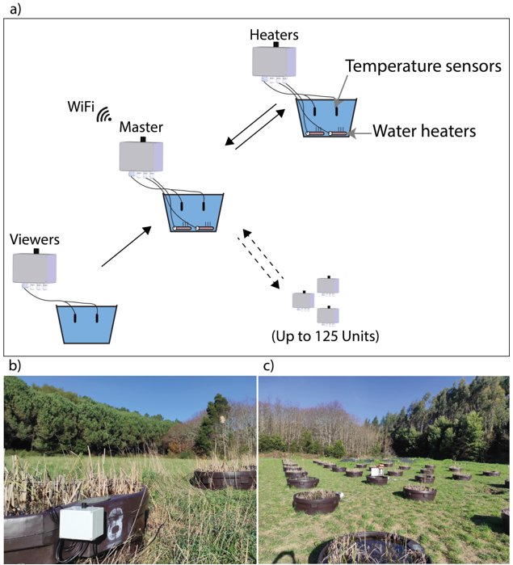
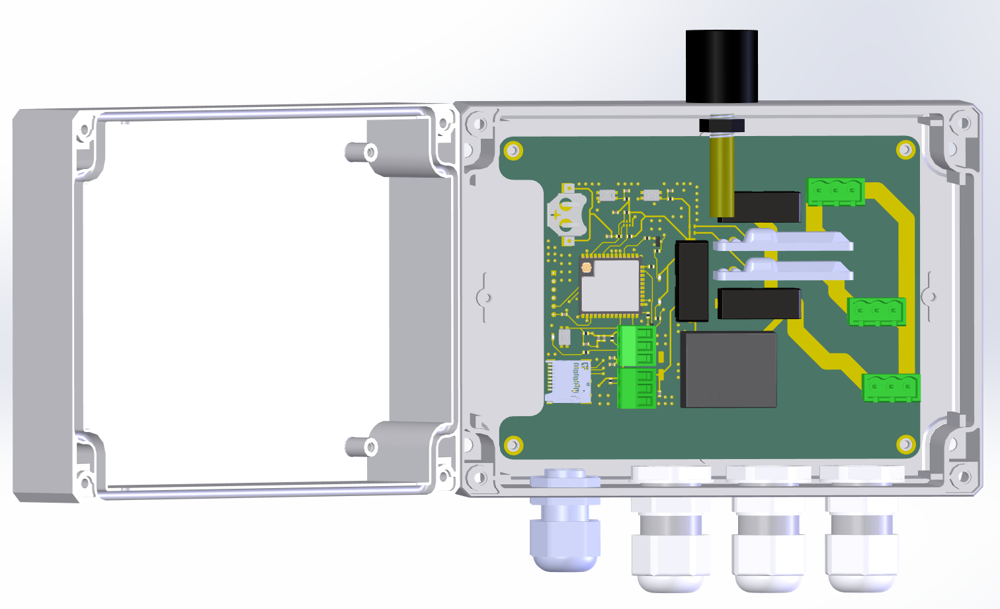

# Wireless_mesocosm
========================================
<table class="table table-hover table-striped table-bordered">
  <tr align="center">
   <td></td>
   <td></td>
  </tr>
</table>
The Mesocosm system enables real-time, remote management of water temperature, accommodating natural fluctuations and simulated warming scenarios. Designed with affordability and scalability in mind, this innovative approach facilitates a wide range of experimental applications, advancing our understanding of global change impacts within diverse aquatic ecosystems.

Repository Contents
-------------------

* **/Documents** - Settings and data record exampel
* **/Hardware** - kicad PCB files
* **/Firmware** - Cpp firmware (Arduino IDE)
* **/Mechanical** - Structural parts
* **/BOM** - Complete list of components and cost
* **/Images** - Images from the device
